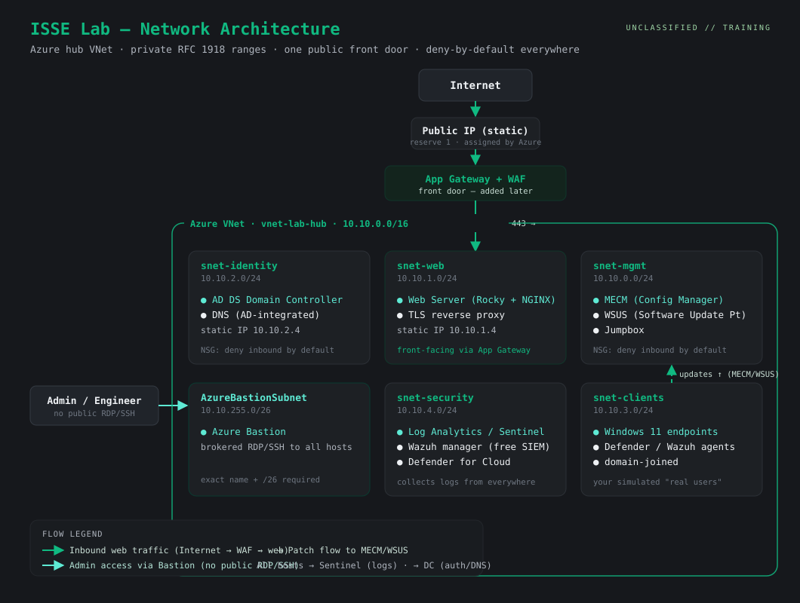

# ISSE Azure Lab — Architecture & Networking

> Plain-English design doc for the lab environment. This is the "map" of everything we build, written so a non-expert can follow it, and structured so it doubles as portfolio documentation when pushed to GitHub.

> Companion doc: see **[tagging-and-bootstrap.md](./tagging-and-bootstrap.md)** for the resource-tagging standard and the VM bootstrap pattern referenced throughout this design.

---

## 1. The big picture (in plain terms)

Think of the whole environment as a **private office building** in the cloud:

- The **VNet** (Virtual Network) is the building. Nothing inside it is reachable from the street unless we deliberately open a door.
- **Subnets** are the floors of the building, each with a job (web, identity, management, clients, security, admin entry).
- **NSGs** (Network Security Groups) are the locked doors between floors — set to **deny by default**, so only traffic we explicitly allow gets through.
- The **one public door** is a single front entrance for the web server (added later, behind a Web Application Firewall). Everything else stays private.
- **Azure Bastion** is the guarded staff entrance: admins get in through it, so we never expose RDP/SSH to the open internet.

That single design choice — *private by default, one controlled front door, brokered admin access* — is the backbone of almost every security control an auditor checks.

---

## 2. Private vs. public addresses (the part people mix up)

**Private IP addresses** are internal-only. They use the reserved **RFC 1918** ranges (anything starting `10.`, `172.16–31.`, or `192.168.`). They don't exist on the public internet — like phone extensions inside an office. We use the `10.10.x.x` family for the whole lab.

**Public IP addresses** are internet-reachable. Here's the key thing many people don't realize: **you don't pick your public IP — Azure assigns one from its pool.** You *can* reserve a **Static** public IP so it doesn't change on reboot, but the actual number is handed to you. That's why the diagram shows the public IP as a reserved placeholder, not an invented address.

We attach exactly **one** public IP, and even that doesn't go straight onto the web server — it sits on a front door (Application Gateway + WAF) that forwards safe traffic to the web server's *private* address. Smaller attack surface, one place to watch.

---

## 3. The IP addressing scheme

One VNet, carved into `/24` subnets (256 addresses each). Azure reserves the first 4 and the last address of every subnet, so **usable host addresses start at `.4`.**

| Subnet name | CIDR range | Purpose | Key hosts (static IPs) |
|---|---|---|---|
| `snet-identity` | `10.10.2.0/24` | Active Directory + DNS | Domain Controller — `10.10.2.4` |
| `snet-web` | `10.10.1.0/24` | Front-facing web tier | Web server (Rocky/NGINX) — `10.10.1.4` |
| `snet-mgmt` | `10.10.0.0/24` | Management & patching | MECM `10.10.0.4`, WSUS `10.10.0.5`, Jumpbox `10.10.0.6` |
| `snet-clients` | `10.10.3.0/24` | Simulated end-user endpoints | Windows 11 clients (DHCP-style, `.4`+) |
| `snet-security` | `10.10.4.0/24` | Logging, SIEM, monitoring | Log Analytics/Sentinel, Wazuh manager |
| `AzureBastionSubnet` | `10.10.255.0/26` | Secure admin entry | Azure Bastion (Azure-managed) |
| **Public** | *reserved static, Azure-assigned* | One internet front door | Application Gateway + WAF → `snet-web` |

Notes:
- `AzureBastionSubnet` **must** use that exact name and be at least a `/26` — Azure enforces this.
- The Domain Controller and web server get **static** private IPs because other machines point at them by address (DNS, web). Clients can be dynamic.
- Whole VNet is `10.10.0.0/16`, leaving tons of room to add subnets later without renumbering.

---

## 4. What lives where, and why (component tour)

- **`snet-identity` — the bouncer + the phonebook.** The Domain Controller answers "who are you and what can you touch" (authentication) and DNS answers "where is everything." Everything else depends on these two, so they get a quiet, static home.
- **`snet-web` — the storefront.** The Rocky Linux + NGINX server. Today it's internal; later it becomes the public-facing site behind the WAF. Hardened to a STIG baseline. Internally it uses a cert from your own CA (self-signed in the lab); once public-facing in the DMZ it needs a publicly-trusted, auto-renewing cert (Let's Encrypt/ACME) — public cert lifetimes are now 200 days and dropping to 47 by 2029, so manual renewal isn't viable.
- **`snet-mgmt` — the control room.** Where we drive the fleet: the jumpbox for hands-on work, **WSUS** as the update warehouse, and **MECM** as the brain that orchestrates patching and software deployment (see §5).
- **`snet-clients` — the "real users."** A couple of domain-joined Windows 11 machines that stand in for employee laptops. This is where we practice pushing policy and onboarding security agents. (No full VDI needed — these are just regular client VMs joined to the domain.)
- **`snet-security` — the security camera room.** Log Analytics/Sentinel (cloud SIEM), Wazuh (free SIEM/agent), and Defender for Cloud. Everything sends its logs here so we can detect and prove what happened.
- **`AzureBastionSubnet` — the guarded staff door.** The only way admins reach machines, with no public RDP/SSH anywhere.

---

## 5. Patching: WSUS + MECM (how updates really ship)

People often think WSUS alone runs Windows updates. In a real enterprise it usually doesn't — **MECM sits on top of WSUS and does the driving.** Here's the plain-English split:

- **WSUS = the warehouse.** It downloads Microsoft updates, stores the files, and hands them out. It's the engine, but on its own it's clumsy to target and report on.
- **MECM (Microsoft Configuration Manager) = the control panel.** It plugs into WSUS through a role called the **Software Update Point (SUP)** and adds everything WSUS lacks: precise targeting ("device collections"), scheduling with maintenance windows, rich compliance reporting, plus software deployment and OS imaging. MECM doesn't replace WSUS — **the SUP role must run on a server that has WSUS installed**, and MECM tells WSUS what to do.

Naming lineage so the acronyms don't trip you up: **SMS → SCCM → MECM → "Microsoft Configuration Manager" (ConfigMgr)**. People still say "SCCM" and "MECM" out loud. Unlike standalone WSUS (which Microsoft deprecated in 2024 but still supports), **ConfigMgr is actively developed and not deprecated** — which is exactly why so much enterprise and classified patching still flows through MECM+WSUS, including the offline export/import method used in air-gapped networks.

**Flow in one line:** Microsoft Update → WSUS (warehouse) ← MECM (control panel) → targeted, scheduled deployments to clients and servers → compliance reported back to MECM and logs to Sentinel.

---

## 6. Screenshot guide (honest version)

Real screenshots can only come from **your** running environment — they can't be invented, and fake ones would undermine a portfolio. So instead, this repo ships a **capture checklist**: build each piece, grab the shot, drop it in `docs/screenshots/`, and caption it in plain English. Create the folder and capture these as you go:

| File name | What to capture | One-line caption to write |
|---|---|---|
| `01-vnet-subnets.png` | Azure portal VNet showing all subnets + CIDRs | "Hub VNet segmented into purpose-built subnets, deny-by-default." |
| `02-nsg-rules.png` | An NSG rule list for `snet-web` | "Least-privilege NSG: only 443 inbound to the web tier." |
| `03-terraform-apply.png` | Terminal after a successful `terraform apply` | "Entire network built from code (IaC), reproducibly." |
| `04-bastion-session.png` | A Bastion browser session into a host | "Brokered admin access — no public RDP/SSH exposed." |
| `05-ad-dc.png` | AD Users & Computers / DNS console | "Domain controller + AD-integrated DNS online." |
| `06-stig-scan.png` | OpenSCAP/SCAP scan report summary | "Linux host scanned and hardened to DISA STIG baseline." |
| `07-mecm-sup.png` | MECM console: Software Update Point / a deployment | "MECM driving WSUS to target and schedule patches." |
| `08-defender-or-sentinel.png` | Defender portal or a Sentinel incident | "Endpoint telemetry flowing to the SIEM; detection working." |

Tip: blur or crop anything sensitive in a screenshot (subscription IDs, real public IPs, account names) before committing — same hygiene as the rest of the repo.

---

## 7. Consistency check — the "delta" pass

A quick review that everything lines up and nothing contradicts:

- **No overlapping address ranges.** Every subnet is a distinct `/24` inside `10.10.0.0/16`; Bastion is an isolated `/26` high in the range. ✔
- **Names match the build.** These subnet names (`snet-identity`, `snet-web`, `snet-mgmt`, etc.) are the expanded version of the earlier sketch (the old "management/domain" placeholders became `snet-mgmt`/`snet-identity`, and `snet-clients` + `snet-security` were added). Use these names everywhere from now on so the Terraform, the diagram, and the docs agree. ✔
- **Public/private boundary is correct.** Exactly one public IP, on the front door (WAF) — never directly on a VM. ✔
- **Dependencies are satisfied.** DNS points at the DC; the DC and web server have static IPs; clients are domain-joined; all hosts log to `snet-security`. ✔
- **Patching path is complete.** WSUS present, MECM's SUP role lands on the WSUS host, deployments target client/server collections. ✔
- **Tagging is applied from creation, not bolted on.** Every resource carries the common tag set (`environment`, `owner`, `project`, `managedBy`, `dataClassification`) defined once in Terraform `locals`; Azure Policy enforces it in the governance phase. ✔
- **Bootstrap is minimal and secret-free.** First-boot config (cloud-init for Linux, Custom Script Extension for Windows) only brings hosts to a known state; real hardening runs through Ansible/OpenSCAP, and no secrets live in `custom_data`. ✔
- **Two things you must keep true as you build:** (1) every subnet keeps an NSG with default-deny inbound, and (2) the VNet's DNS setting points to the DC's static IP — break either and half the environment quietly fails.

Everything translates and is internally consistent. **Tagging is cross-cutting** — define the common tag set in Terraform before you create the first resource, and enforce it with Azure Policy in the governance phase, so it's never retrofitted. Build order that respects the dependencies: **network → identity (DC/DNS) → management (WSUS→MECM) → web → clients → security/logging → public front door** — with tags applied to every resource along the way, and a minimal bootstrap script attached at each VM's creation.
